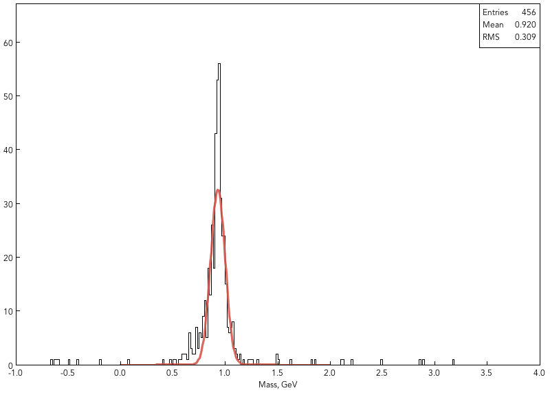

Analyzing Reconstructed Data
****************************

This section describes analysis tools available within clara framework
to analize reconstructed data events.

Groovy Scripts
==============

The analysis can be run as groovy scripts, and all Java classes can be used
inside groovy script. This method ties well with the framework and provides
standard tools for reading EVIO files and reconstruction banks. To run groovy
scripts the groovy package has to be installed on the computer. On OSX machines
this can be done by:

.. code-block:: bash
   
   > sudo port install groovy

On Jlab farm machines one has to initialize groovy by:

.. code-block:: bash

   > use groovy

Once groovy is installed on the system any groovy script can be run using:

.. code-block:: bash

   coatjava> bin/run-groovy myscript.groovy

The example scripts are located in scripts folder in the distribution.

Reading EVIO files
==================

The output of reconstruction is an EVIO file with bank structures defined in XML 
files. The XML descriptors are located in etc/bankdef/clas12 directory. Following 
script will run through events in the file:

.. code-block:: java
	    
       import org.jlab.io.evio.*;
       
       EvioSource reader = new EvioSource();
       reader.open("myfile.evio");
       while(reader.hasEvent()){
	  EvioDataEvent event = reader.getNextEvent();
	  event.show(); // print out all banks in the event
       }

The banks are reffered to with their name and the section separated by '::',
for example to read digitized bank from DC the following code can be used:

.. code-block:: java

   ...
   EvioDataEvent event = reader.getNextEvent();
   if(event.hasBank("DC::dgtz")){
      EvioDataBank dcBank = event.getBank("DC::dgtz");
      dcBank.show(); // printout the content of the bank
   }
   ...

The EvioDataSource object is derived from DataSource interface, and there are several implementations
of DataSource, one of them is the BOS (legacy CLAS6 format) reader. In the same manner the BOS files
can be read within our Java framework with no additional effort. To read bos files the bos reader 
interface can be used. There are slight differences in the bank description in BOS format, since the
BOS banks are numbered, the descriptor to reatrieve particular bank should contain the number of the 
bank within the name, if no number is present '0' will be assumed.

Reading Reconstruction Events
=============================

The EVIO structures produced by reconstruction program can be parsed to produce
events for physics analysis. There is a standard interface allowing to implement
different ways to identify particles. One simple implementation exists called
GenericKinematicFitter which reads generated particle bank and the reconstructed
particle bank with the PID assigned by standrard Event Builder. Example:

.. code-block:: java
   
   import org.jlab.io.evio.*;
   import org.jlab.clas.physics.*;
   
   EvioSource reader = new EvioSource();
   reader.open("myrec.evio");
   // create new kinematic fitter, with beam energy 11.0 GeV and electron filter
   GenericKinematicFitter fitter = new GenericKinematicFitter(11.0);
   
   while(reader.hasEvent()==true){
      EvioDataEvent event = reader.getNextEvent();
      PhysicsEvent  recEvent  = fitter.getPhysicsEvent(event);
      PhysicsEvent  genEvent  = fitter.getGeneratedEvent(event);
      System.out.println(genEvent.toLundString());
      System.out.println(recEvent.toLundString());
   }

This will print out on the screen generated event and reconstructed event.

Working with Physics Events
===========================

Physics event object is a container for particles and has a beam particle and 
a target particle, there are few convenience methods that alow checking the 
final state of the event. Particle id's are used to require specific particle
to be in the final state, and "X" followed by the sign is used to require any 
number of particles with particular charge. For example "X+" means any number 
of positively charged particles, "X-" and "Xn" for negative and neutral particles
respectively. EventFilter object must be created to check the final state
of the event.

.. code-block:: java
   
   ...
   EventFilter  filter = new EventFilter("11:2212:-211:X+:X-:Xn");
   if(filter.isValid(recEvent)==true){
	Particle mx_eppi = recEvent.getParticle("[b]+[t]-[11]-[2212]-[-211]");
	double mass  = mx_eppi.mass();
	double mom   = mx_eppi.p();
	double theta = mx_eppi.theta();
	double phi   = mx_eppi.phi();
   }
   ...

The code above checks if the event has at least one electron, one proton and one 
negative pion and then constructs a missing mass of "e-,p,pi-". The symbol "[b]"
stands for beam particle and "[t]" stands for target particle. There can be multiple
particle of the same kind in the event, and the syntax allows picking up particles
by the order. For example:

.. code-block:: java
   
   ...
   EventFilter  filter = new EventFilter("11:2212:2212"); // exclusive e-,p,p
   if(filter.isValid(recEvent)==true){
	Particle mx_epp = recEvent.getParticle("[b]+[t]-[11]-[2212,0]-[2212,1]");
   }
   ...

Entry "[2212,1]" takes the second (skip=1) proton from the event, "[2212,0]" takes the first
event, if no skip parameter is mentioned first particle is assumed "[2212]" is same 
as "[2212,0]".
The following example loops through events and plots the missing mass of two pions.
The data used in the following example can be generated from the .dat (Lund) files here: 
https://userweb.jlab.org/~gcharles/Tutorials/.
Then, wherever you have Gemc and Coatjava working, successively types the following commands:

.. code-block:: bash
   
   > gemc /group/clas12/clas12.gcard -INPUT_GEN_FILE="LUND, clasdispr.00.e11.000.emn0.75tmn.09.xs65.61nb.113.0000.dat" -OUTPUT="evio, test.evio" -RUNNO=11 -USE_GUI=0 -N=100
   > bin/gemc-evio test.evio 10 -1.0 1.0
   > bin/clara-rec -t 1 -r etc/services/reconstruction.yaml output.0.evio output_rec.evio

These commands are explained earlier in this tutorial.
The generation of a sufficient number of events to obtain nice results being long, you
are advised to generate only a few hundred events. If you want to see the result for more events,
a file containing 10000 events has been generated and can be found here: https://userweb.jlab.org/~gcharles/Tutorials/
The groovy script to obtain the missing mass plot can be downloaded in the same folder and is duplicated here.

.. code-block:: java
   
   import org.jlab.clas.physics.EventFilter;
   import org.jlab.groot.ui.TCanvas;
   import org.jlab.clas.physics.GenericKinematicFitter;
   import org.jlab.clas.physics.Particle;
   import org.jlab.clas.physics.RecEvent;
   import org.jlab.groot.data.H1F;
   import org.jlab.io.evio.EvioDataChain;
   import org.jlab.io.evio.EvioDataEvent;
   import org.jlab.groot.math.*;
   import org.jlab.groot.graphics.*;
   import javax.swing.JFrame;
   import org.jlab.groot.fitter.*;

   EvioDataChain reader = new EvioDataChain();
     reader.addFile("output_rec.evio"); //Add Reconstructed Event File
     reader.open();
   GenericKinematicFitter fitter = new GenericKinematicFitter(11.0); //Sets Beam Energy to 11.0 GeV
     EventFilter filter = new EventFilter("11:211:-211:X+:X-:Xn"); //Filters events with electrons pi+ and pi-
   
   //Declare Histogram and enable stat box
   H1F MxPiPi = new H1F("MxPiPi",300,-1,4); 
     MxPiPi.setOptStat("1110");
     MxPiPi.setTitleX("Mass, GeV");
   
   //Create a gaussian and set the limits as well as parameters below which can be changed
   F1D f1 = new F1D("f1","[amp]*gaus(x,[mean],[sigma])", 0, 2); 
     f1.setParameter(0, 200.0);
     f1.setParameter(1, 1.0);
     f1.setParameter(2, 1.0);
   
   
   int eventCounter = 1;
   while(reader.hasEvent()==true)
   {
	   eventCounter++;
	   EvioDataEvent event = reader.getNextEvent();
	   RecEvent recEvent  = fitter.getRecEvent(event);
	   recEvent.doPidMatch();
	   if(filter.isValid(recEvent.getReconstructed()))
	   {
		   Particle ppippim = recEvent.getReconstructed().getParticle("[b]+[t]-[11,0]-[211,0]-[-211,0]"); //missing mass
		   MxPiPi.fill(ppippim.mass());
	   }
   
   }

   //window to draw canvas and histogram on
   JFrame frame = new JFrame("mmx"); 
     frame.setSize(800,600);
     f1.setParameter(0, MxPiPi.getEntries()); //resetting fit parameters to histogram specs
     f1.setParameter(1, MxPiPi.getMean());
     f1.setParameter(2, MxPiPi.getRMS());
   DataFitter.fit(f1,MxPiPi,"Q"); //fit histogram
   //canvas to draw histogram on
     EmbeddedCanvas can = new EmbeddedCanvas(); 
     can.divide(1, 1);
     can.cd(0);
     can.draw(MxPiPi);
     can.draw(f1,"same");
     f1.setLineColor(32);
     f1.setLineWidth(3);
     f1.setLineStyle(0);
     frame.add(can);
     frame.setVisible(true);

The code loops through events and picks events corresponding to the given filter
then gets particle for given string syntax and fills the mass histogram.
The missing mass histogram is then fitted by a Gaussian.

You should obtain the following graph.

Selecting particles
===================

PhysicsEvent object can be used to construct composite particles from the final sate 
(as in the examples above), but it can alse be used to loop through particles with
either given charge or given pid. Example:

.. code-block:: java

   ...
   int nparticles = recEvent.count(); // returns number of particles
   int nphotons   = recEvent.countByPid(22); // returns number of photons
   int nneutrals  = recEvent.countByCharge(0); // return number of particles with charge=0
   int npositive  = recEvent.countByCharge(1); // return number of particles with charge=+1
   ...
   if(nphotons>=2){
      Particle  photon1 = recEvent.getParticleByPid(22,0); // skip=0, returns first photon
      Particle  photon2 = recEvent.getParticleByPid(22,1); // skip=1, skips first and returns second photon
      System.out.println(" mom 1 = " + photon1.mass() + "  mom 2 = " + photon2.p());
   }
   ...
   for(int loop = 0; loop < npositive; loop++){
      Particle posPart = recEvent.getParticleByCharge(1,loop); // skips loop particles to return the next one
      if(posPart.pid()==211){
	System.out.println(" found pion with angle = " + posPart.theta());
      }
   }
   ...

The loop over all particles can also be made by checking their pid:

.. code-block:: java

   ...
   int nparticles = recEvent.count(); // returns number of particles
   for(int loop=0; loop < nparticles; loop++){
      Particle part = recEvent.getParticle(loop);
      if(part.pid()==2212){
	System.out.println(" found proton in row " + loop);
	System.out.println(" vertex Z = " + part.vertex().z() );
      }
   }
   ...

Working with Particles
======================

The implementation of Particle class provides operations with particles, such as combine them,
calculating vertex or matching particles. (Examples SOON).
