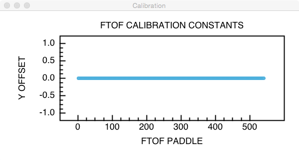

.. _clas-geomtry:

CLAS Calibration Database
*************************

CLAS geomtery uses the CCDB database for storing calibration constants.

Reading Database Table
======================

DatabaseContantProvider class is used for reading database tables and accessing
the data. The table contains multiple columnd, each column is read as one variable
and stored as an array of strings. Example session:

.. code-block::      java

	// Program reads geometry constants from CCDB database
	import org.jlab.clasrec.utils.*;
	import org.jlab.geom.base.ConstantProvider;

	// initialize database connection provider for RUN #=10 and variation = default
	DatabaseConstantProvider  dbprovider = new DatabaseConstantProvider(10,"default");

	// load table reads antire table and makes an array of variables for each column in the table.
	dbprovider.loadTable("/calibration/ftof/attenuation");

	// disconncect from databas. Important to do this after loading tables.
	dbprovider.disconnect();

	// printout names of columns and lengths for each variable
	dbprovider.show();

The output:

.. code-block:: bash

	[DB] --->  open connection with : mysql://clas12reader@clasdb.jlab.org/clas12
	[DB] --->  database variation   : default
	[DB] --->  database run number  : 10
	[DB] --->  database connection  : success
	[DB LOAD] ---> loading data table : /calibration/ftof/attenuation
	[DB LOAD] ---> number of columns  : 8

	[DB] --->  database disconnect  : success

		**********************************************************************
		*  Item Name                                            :   Length   *
		**********************************************************************
		*  /calibration/ftof/attenuation/y_offset               :      540   *
		*  /calibration/ftof/attenuation/paddle                 :      540   *
		*  /calibration/ftof/attenuation/panel                  :      540   *
		*  /calibration/ftof/attenuation/length_unc_left        :      540   *
		*  /calibration/ftof/attenuation/length_left            :      540   *
		*  /calibration/ftof/attenuation/sector                 :      540   *
		*  /calibration/ftof/attenuation/length_right           :      540   *
		*  /calibration/ftof/attenuation/length_unc_right       :      540   *
		**********************************************************************

The connection line shows that data was loaded from mysql database of clas12. The sqlite3 version
of the database is included with coatjava package. In the event that local copy of the database
should be used, one can set an environmental variable to force software to use local sqlite3 database.

use:

.. code-block:: bash

	setenv CCDB_DATABASE etc/database/clas12database.db

The environment variable CLAS12DIR also has to be set to point to the directory where coatjava is
located. All the scripts in bin directory already set CLAS12DIR to proper location, so when using
coatjava package scripts there is no need to set it separately.

Reading constant from provider
------------------------------

To loop through all values in the variable use:

.. code-block::      java

	for(int loop = 0; loop < dbprovider.length("/calibration/ftof/attenuation/y_offset"); loop++){
		double value = dbprovider.getDouble("/calibration/ftof/attenuation/y_offset",loop);
		// for integer values use dbprovider.getInteger("/calibration/ftof/attenuation/y_offset",loop);
	}

Plotting Calibration Constants
------------------------------

Calibration constants can be plotted from the constant provider. Constant provider can return a graph
for each column in the table. 

.. code-block::      java

	import org.jlab.clasrec.utils.*;
	import org.jlab.geom.base.ConstantProvider;
	import org.root.pad.*;
	import org.root.histogram.*;

	// Code from previous example (loading the table from database) 
	//.......

	GraphErrors  graph = dbprovider.getGraph("/calibration/ftof/attenuation/y_offset");
	TGCanvas    canvas = new TGCanvas("canvas","Calibration",600,300,1,1);

	graph.setTitle("FTOF CALIBRATION CONSTANTS");
	graph.setXTitle("FTOF PADDLE");
	graph.setYTitle("Y OFFSET");

	canvas.cd(0);
	canvas.draw(graph);

At the time of writing this tutorial all constants in the FTOF table were set to 0, that's why graph does 
not look particularly interesting.

Reading Calibration Constants Indexed
-------------------------------------

To provide a common interface to all detector systems CLAS12 calibration constants are kept in strictly
defined table structures. All related contants that are calibrated at the same time are kept in a table
with sector,layer and component being a column in a table, here is an example of ftof table:

.. code-block::  bash

	/calibration/ftof> cat effective_velocity
	+-------------------------------------------------------------------------------------------------+
	| sector     | layer      | component  | veff_left  | veff_right | veff_left_err | veff_right_err |
	| int        | int        | int        | double     | double     | double        | double         |
	+-------------------------------------------------------------------------------------------------+
	| 1          | 1          | 1          | 16.00      | 16.00      | 0.32          | 0.32           |
	| 1          | 1          | 2          | 16.00      | 16.00      | 0.32          | 0.32           |
	| 1          | 1          | 3          | 16.00      | 16.00      | 0.32          | 0.32           |
	| 1          | 1          | 4          | 16.00      | 16.00      | 0.32          | 0.32           |
	| 1          | 1          | 5          | 16.00      | 16.00      | 0.32          | 0.32           |
	| 1          | 1          | 6          | 16.00      | 16.00      | 0.32          | 0.32           |
	| 1          | 1          | 7          | 16.00      | 16.00      | 0.32          | 0.32           |
	| 1          | 1          | 8          | 16.00      | 16.00      | 0.32          | 0.32           |
	| 1          | 1          | 9          | 16.00      | 16.00      | 0.32          | 0.32           |
	....
	....

To read these kind of tables in the software use the following script:

.. code-block::  java

	ClibrationConstants calibAtten = new CalibrationConstants();
    calibAtten.loadTable("/calibration/ftof/attenuation", 10, "default");
        
    System.out.println("ATTENUATION LEFT/RIGHT  = "
            + calibAtten.getEntry("attlen_left", 2, 1, 15)
            + " / " + calibAtten.getEntry("attlen_right", 2, 1, 15));

The code requests constants for sector=2, layer=1 and paddle=15. The produced printout will look like:

.. code-block::  bash

	ATTENUATION LEFT/RIGHT  = 187.53 / 187.53

