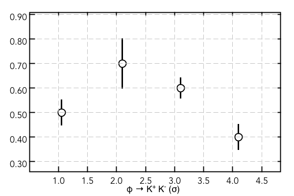
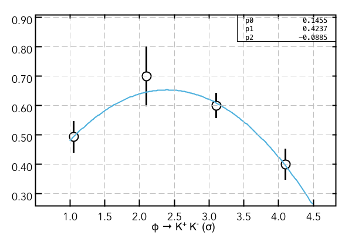

Data Graph Plotting
===================

Define and plot a graph
-----------------------

.. code-block:: java

   import org.root.pad.*;
   import org.root.data.*;
   import org.root.func.*;
   import org.root.histogram.*;

   TGCanvas c1 = new TGCanvas("c1","My Plots",600,400,1,1); // Create Canvas with (1,1) divisions

   c1.setAxisFontSize(18); // if set to small number the margins will automatically change
   c1.setTitleFontSize(18); // Set the title font size (margins adjust automatically)

   double[] x  = [ 1.1, 2.1, 3.1, 4.1]; // this is groovy syntax for array initialization
   double[] y  = [ 0.5, 0.7, 0.6, 0.4]; // in java : double[] x = new double[]{1.0,2.0,3.0,4.0};
   double[] ex = [ 0.0, 0.0, 0.0, 0.0];
   double[] ey = [ 0.05, 0.1, 0.04, 0.05];

   //GraphErrors  graph = new GraphErrors(x,y); // define graph with   X-Y points
   GraphErrors  graph = new GraphErrors(x,y,ex,ey); // define graph with   X-Y points and X and Y errors

   graph.setTitle("Example Graph"); // Set   the Title string for the PAD
   graph.setXTitle("#phi #rarrow K^+ K^- (#sigma)"); // X axis title

   graph.setMarkerColor(1); // color from 0-9 for given palette
   graph.setMarkerSize(15); // size in points on the screen
   graph.setMarkerStyle(1); // Style can be 1 or 2
   graph.setLineWidth(3); // Style can be 1 or 2
   graph.setLineColor(1); // Style can be 1 or 2

   c1.draw(graph);
   c1.save("graph-example.png");

Resulting plot:

Fitting graphs
--------------

For fitting the graph one has to define a function and use fit method of the graph. Functions
are defined as in root with a string and a range. 

.. code-block:: java

   F1D  func = new F1D("p2",1.0,4.5);

   graph.fit(func,"REQ"); // R - enforce function range, 
                          // E - use errors in the fit, Q - disable Minuit printout
   c1.draw(graph);
   c1.draw(func,"same");

Here is the result of the script:

