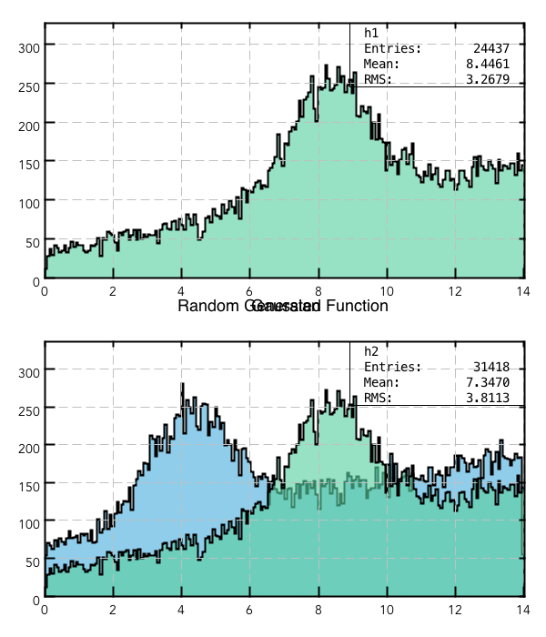
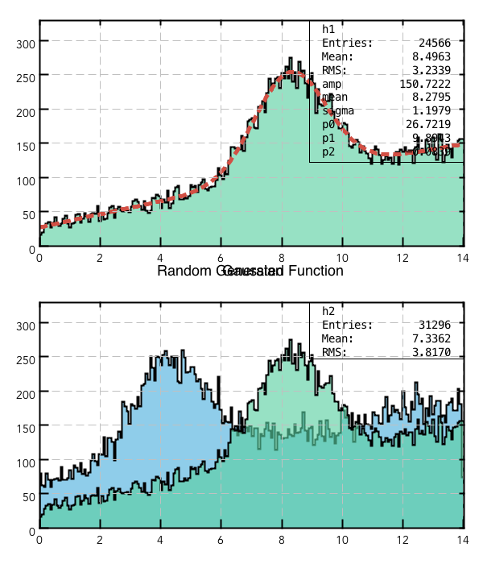
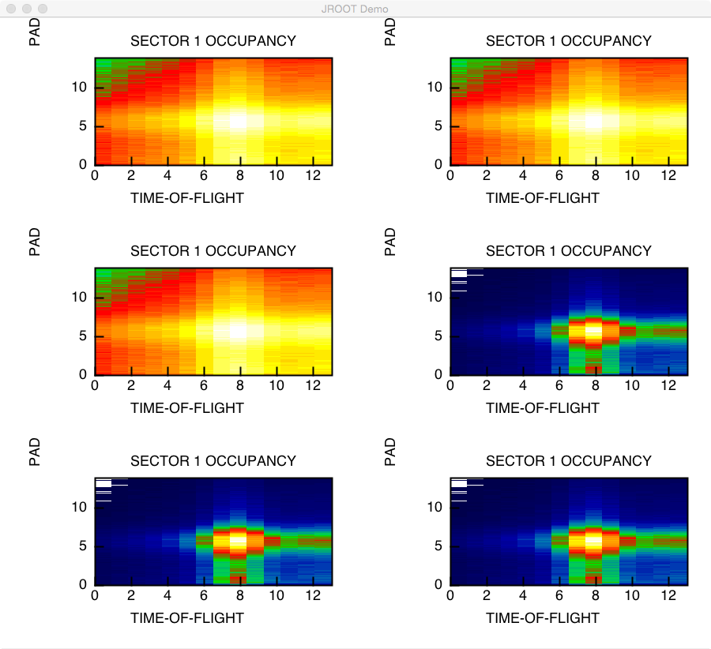

Histogram Plotting
==================

Histogram Drawing
-----------------

.. code-block:: java

   import org.root.pad.*;
   import org.root.histogram.*;
   import org.root.func.*;
   import org.root.attr.*;
   import java.lang.Math;

   TGCanvas c1 = new TGCanvas("c1","JROOT Demo",600,700,1,2);

   c1.setAxisFontSize(14); // change axis font size
   c1.setTitleFontSize(18); // change title font size
   c1.setStatBoxFontSize(14); // change stat box font size

   //TStyle.setOptStat(false); // will disable Stat Box drawing

   H1D h1 = new H1D("h1","Random Function (Gaus + POL2)",200,0.0,14.0);
   H1D h2 = new H1D("h2","Random Function (Gaus + POL2)",200,0.0,14.0);

   h1.setXTitle("Random Generated Function");
   h2.setXTitle("Gaussian");
   h1.setYTitle("Counts");

   F1D f1 = new F1D("gaus+p2",0.0,18.0);

   f1.setParameter(0,120.0);
   f1.setParameter(1,  8.2);
   f1.setParameter(2,  1.2);
   f1.setParameter(3, 24.0);
   f1.setParameter(4,  7.0);

   RandomFunc rndm = new RandomFunc(f1);

   for(int i = 0; i < 34000; i++){
      h1.fill(rndm.random());
      h2.fill(rndm.random()-4.0);
   }

   //c1.getCanvas().divide(1,2);

   h1.setLineWidth(2);
   h1.setFillColor(38);

   h2.setLineWidth(2);
   h2.setFillColor(34);

   c1.cd(0);
   c1.draw(h1);

   c1.cd(1);
   c1.draw(h2);
   c1.draw(h1,"same");

   c1.save("h1d-example.png");   
   

Histogram Fitting
-----------------

Adding following lines to the above script:

.. code-block:: java

   F1D f2 = new F1D("gaus+p2",0.0,14.0);
   h1.fit(f2,"REQ");

   f2.show(); // print on the screen fit results
   
   f2.setLineColor(2);
   f2.setLineWidth(5);
   f2.setLineStyle(2);
   ....
   ....
   c1.draw(f2,"same");

The screen printout is :

.. code-block:: bash

   FUNCTION : gaus+p2
   LIMITS   : 0.000000e+00 1.400000e+01

                  amp :       1.507222e+02       2.832056e-01      -1.000000e+10       1.000000e+10
                 mean :       8.279544e+00       2.136959e-03      -1.000000e+10       1.000000e+10
                sigma :       1.197907e+00       2.742442e-03      -1.000000e+10       1.000000e+10
                   p0 :       2.672190e+01       2.504203e-01      -1.000000e+10       1.000000e+10
                   p1 :       9.894350e+00       1.101680e-01      -1.000000e+10       1.000000e+10
                   p2 :      -8.386536e-02       7.392821e-03      -1.000000e+10       1.000000e+10

And the saved canvas:

2D Histograms
-------------

.. code-block:: java

   import org.root.pad.*;
   import org.root.histogram.*;
   import org.root.func.*;
   import java.lang.Math;

   TGCanvas c1 = new TGCanvas("c1","JROOT Demo",900,800,2,3);
   //c1.setFontSize(14);

   H1D h1 = new H1D("h1","Random Function (Gaus + POL2)",200,0.0,14.0);
   H2D h2 = new H2D("h2",14,0.0,14.0,120,0.0,14.0);

   h1.setXTitle("Random Generated Function");
   h1.setYTitle("Counts");

   h2.setTitle("SECTOR 1 OCCUPANCY");
   h2.setXTitle("TIME-OF-FLIGHT");
   h2.setYTitle("PADDLES");

   F1D f1 = new F1D("gaus+p2",0.0,14.0);
   f1.setParameter(0,120.0);
   f1.setParameter(1,  8.2);
   f1.setParameter(2,  1.2);
   f1.setParameter(3, 24.0);
   f1.setParameter(4,  7.0);

   RandomFunc rndm = new RandomFunc(f1);

   for(int i = 0; i < 840000; i++){
      h2.fill(rndm.random(),rndm.random());
   }

   for(int p = 0; p < 6; p++){
     c1.cd(p);
     if(p<3) c1.setLogZ();
     c1.draw(h2);
   }

